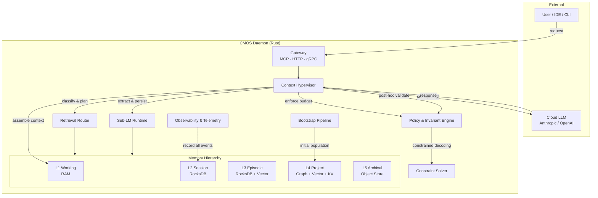
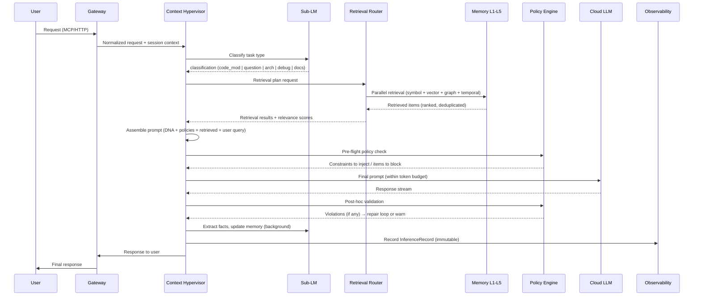

# CMOS Architecture

> Master architecture document. Single source of truth for system design.
> For rationale behind individual decisions, see [ADR index](./02-decisions/).
> For scope boundaries, see [scope files](./03-scope/).

---

## 1. System Overview

CMOS (Cognitive Memory Operating System) is an **external cognitive substrate** that wraps any cloud LLM, turning it from a stateless text generator into a persistent, policy-governed, observable reasoning engine.

**Core thesis:** LLM is a stateless co-processor `f(context) → tokens`. CMOS owns all persistent state — memory, identity, policies, history, relationships, decisions ([ADR-001](./02-decisions/ADR-001-stateless-llm-coprocessor.md)).

**Two-LLM economy:** bulk cognitive work (extraction, summarization, dedup, classification, drift detection) runs on a local Sub-LM (3B–32B). The cloud LLM receives only compressed, filtered, validated context ([ADR-003](./02-decisions/ADR-003-two-llm-economy.md)).

**Multi-project isolation:** every memory item, policy, episode, and trace carries an explicit `project_id`. No implicit "current project" ([ADR-004](./02-decisions/ADR-004-multi-project-from-day-one.md)).

---

## 2. Component Map



### Data Flow Summary

1. **Inbound:** User request arrives via MCP/HTTP/gRPC at Gateway ([ADR-010](./02-decisions/ADR-010-mcp-first-integration.md)).
2. **Classification:** Context Hypervisor classifies the task via Sub-LM.
3. **Retrieval Planning:** Retrieval Router builds a parallel retrieval plan (symbol lookup + vector + graph + temporal + episodic).
4. **Assembly:** Hypervisor assembles the prompt within token budget, injecting Project DNA and relevant policies.
5. **Enforcement:** Policy Engine applies hard invariants via constrained decoding or prompt-level injection.
6. **Inference:** Assembled prompt sent to cloud LLM.
7. **Post-processing:** Response validated against policies; extraction pipeline (Sub-LM) persists new facts.
8. **Observability:** Every step recorded as an immutable event ([ADR-005](./02-decisions/ADR-005-time-travel-in-v1.md)).

---

## 3. Memory Hierarchy

Five layers with strict per-layer properties ([ADR-002](./02-decisions/ADR-002-five-layer-memory.md)):

| Layer | Purpose | Size | TTL | Latency | Storage | Content |
|-------|---------|------|-----|---------|---------|---------|
| **L1** Working | Active prompt assembly | 1K–16K tokens | minutes | <1ms | RAM | Assembled prompt, per-turn scratch |
| **L2** Session | Event log of current session | 50K–500K tokens | hours | <5ms | RocksDB | Turns, decisions, scratch facts, inference records |
| **L3** Episodic | Task-level memory | 1M–10M tokens | days–weeks | <50ms | RocksDB + vector index | Completed tasks, lessons learned, rejected approaches |
| **L4** Project | Long-term project brain | 100M–10B tokens | indefinite | <100ms | Graph DB + vector + KV | Ontology, code symbols, policies, DNA, relationships |
| **L5** Archival | Full history | unlimited | indefinite (decay) | <1s | Object storage | All versions, deprecated knowledge, evolution trail |

### Promotion & Demotion

- **L2 → L3:** Task completion triggers episode creation (Sub-LM summarizes, extracts lessons).
- **L3 → L4:** Repeated access + high semantic importance + Sub-LM validation → promoted to project knowledge.
- **L4 → L5:** Superseded facts get tombstoned in L4, full history preserved in L5.
- **Demotion:** Cold L3 episodes decay to L5 after configurable period without access.

### Conflict Resolution

Never overwrite. New fact vs. existing fact → version chain. Conflicts are first-class events surfaced to the user or auto-resolved via recency + confidence scoring.

### Immutability

L4 and L5 are append-only. No hard-delete — only tombstones with version chains ([ADR-009](./02-decisions/ADR-009-append-only-memory-with-tombstones.md)).

---

## 4. Inference Pipeline

End-to-end sequence from user prompt to cloud LLM response:



### Latency Budget (Critical Path)

| Step | Budget | Notes |
|------|--------|-------|
| Classification (Sub-LM) | ≤30ms | Single forward pass, cached model |
| Retrieval planning + execution | ≤100ms | Parallel across stores |
| Prompt assembly | ≤20ms | In-memory composition |
| Policy pre-flight | ≤10ms | Symbolic rule evaluation |
| **Total critical path (pre-LLM)** | **<200ms p95** | Sub-LM: max 1 call on critical path |
| Post-hoc validation | ≤50ms | Runs after response delivered |
| Fact extraction (Sub-LM) | async | Background queue, not on critical path |

---

## 5. Token Reduction Techniques

Twelve techniques ranked by impact. Composite realistic estimate: **8–25× cloud token reduction** on typical tasks. 100× is best-case, not baseline.

| # | Technique | Reduction | Complexity | Component | Scope |
|---|-----------|-----------|------------|-----------|-------|
| 1 | **Sub-LM pre-filtering** | 5–15× | Low | Sub-LM Runtime | [MVP M5](./03-scope/mvp.md) |
| 2 | **Symbolic pre-resolution** | ∞ (where applicable) | Medium | Policy Engine, L4 | [MVP M5](./03-scope/mvp.md) |
| 3 | **Compressed cognition blocks** | 5–20× (repeats) | High | Context Hypervisor | [V1.C](./03-scope/v1.md) |
| 4 | **Semantic delta encoding** | 2–5× (intra-session) | Medium | Context Hypervisor | [V1.C](./03-scope/v1.md) |
| 5 | **Hierarchical summarization** | 3–10× | Low | Sub-LM Runtime | [MVP M5](./03-scope/mvp.md) |
| 6 | **Lazy loading via references** | 5–20× (code tasks) | Medium | Retrieval Router | [MVP M5](./03-scope/mvp.md) |
| 7 | **Prompt caching awareness** | 5–10× cost | Low | Context Hypervisor | [MVP M5](./03-scope/mvp.md) |
| 8 | **Policy injection in imperative form** | 3–5× | Trivial | Policy Engine | [MVP M6](./03-scope/mvp.md) |
| 9 | **Differential retrieval** | 1.5–3× | Low | Retrieval Router | [MVP M5](./03-scope/mvp.md) |
| 10 | **Constraint hoisting** | 1.5–2× | High | Constraint Solver | [V1.D](./03-scope/v1.md) |
| 11 | **Cognitive replay skip** | ∞ | Medium | Context Hypervisor | [V1.C](./03-scope/v1.md) |
| 12 | **Persistent KV-cache** | 10×+ | Very High | Research | [V3.A](./03-scope/v3.md) |

### How Techniques Compose

On a typical code modification task in a mature project:
- Sub-LM pre-filtering removes 80% of irrelevant retrieved context (5×).
- Hierarchical summarization compresses remaining long items (2×).
- Prompt caching reuses prefix across turns (3× cost reduction).
- Policy injection replaces verbose explanations with imperative rules (1.5×).
- **Combined:** ~5× token volume × 3× cache savings = **~15× effective cost reduction**.

---

## 6. Project DNA & Policy Engine

### Project DNA

A structured constitution (5K–20K tokens) always injected into context:

1. **Identity statement** — what this project is, who it serves.
2. **Architectural pillars** — non-negotiable design principles.
3. **Hard invariants** — 10–30 rules that must never be violated.
4. **Style fingerprint** — coding conventions, naming, patterns.
5. **Forbidden patterns** — anti-patterns specific to this project.
6. **Critical context** — domain knowledge essential for any task.

DNA is versioned, diffable, and linked to evidence (decisions, incidents, PRs).

### Three-Tier Policy Model

| Tier | Enforcement | Mechanism |
|------|-------------|-----------|
| **Suggestions** | Mention in prompt | Soft guidance, no validation |
| **Soft invariants** | Mention + post-hoc warn | Sub-LM checks response, warns on violation |
| **Hard invariants** | Constrained decoding + post-hoc check + repair loop | Block or auto-fix violations |

Each policy is a structured object:
```
{
  id, scope, tier, predicate, rationale,
  evidence_refs[], created_at, version,
  violation_count, last_triggered
}
```

### Drift Detection

Background Sub-LM continuously scans new code/responses against policies. Drift trends surface as suggested rules in the DNA Editor. This is the project's **immune system** ([ADR-008](./02-decisions/ADR-008-counterfactual-mode-in-v1.md) enables empirical policy testing).

---

## 7. Observability & Time Travel

Observability is first-class, not an afterthought ([ADR-005](./02-decisions/ADR-005-time-travel-in-v1.md)).

### Event Sourcing

Every inference produces an immutable `InferenceRecord`:

```
InferenceRecord {
  id: UUID,
  project_id: ProjectId,
  timestamp: DateTime,
  task_classification: TaskType,
  retrieval_plan: RetrievalPlan,
  retrieved_items: Vec<ItemRef>,
  assembled_context: ContextSnapshot,
  policies_applied: Vec<PolicyRef>,
  token_budget: TokenBudget,
  llm_request: LLMRequest,
  llm_response: LLMResponse,
  post_hoc_results: Vec<ValidationResult>,
  extracted_facts: Vec<FactRef>,
  duration_ms: u32,
}
```

### Time Travel Debugging

Open any past inference → see the full assembled context of that moment → replay with current memory → compare results. This enables:

- **Regression detection:** did a policy change make things worse?
- **Root cause analysis:** why did the LLM produce X? What was in context?
- **Learning:** what retrieval strategy worked best for this task type?

### Counterfactual Mode

Re-run past inferences with alternative configurations ([ADR-008](./02-decisions/ADR-008-counterfactual-mode-in-v1.md)):

- **Policy counterfactual:** same context, different policy set.
- **DNA counterfactual:** same query, different DNA version.
- **Retrieval counterfactual:** same query, different retrieval strategy.

Sub-LM runs counterfactuals in background by default. Cloud LLM counterfactuals are opt-in (cost-aware).

---

## 8. Integration Architecture

### Protocol Hierarchy ([ADR-010](./02-decisions/ADR-010-mcp-first-integration.md))

| Protocol | Purpose | Clients |
|----------|---------|---------|
| **MCP** (primary) | IDE/CLI integration | Claude Code, Cursor, Continue, Claude Desktop |
| **HTTP/WebSocket** | GUI, external tools | Cognitive Console, custom dashboards |
| **gRPC** | Internal high-perf | Sub-LM ↔ Core, future distributed nodes |

### GUI Architecture ([ADR-007](./02-decisions/ADR-007-tauri-hybrid-gui-shell.md))

```
┌─────────────────────────────────────────────┐
│  Tauri Shell (Rust, 3-10 MB binary)         │
│  ┌───────────────────────────────────────┐  │
│  │  Web Core (React + TypeScript)        │  │
│  │  ├── Zustand (state)                  │  │
│  │  ├── WebSocket (real-time)            │  │
│  │  ├── uPlot (timeseries)              │  │
│  │  ├── Cytoscape.js (graphs)           │  │
│  │  └── Monaco (code viewer)            │  │
│  └───────────────────────────────────────┘  │
└─────────────────────────────────────────────┘
         │ same web core deployed as:
         ├── VS Code Extension (V1)
         ├── JetBrains Plugin (V2)
         └── Standalone Web (V1)
```

Design philosophy: high-density, DevTools-style ([ADR-006](./02-decisions/ADR-006-gui-density-devtools-style.md)). Information per square inch over whitespace aesthetics.

---

## 9. Bootstrap Pipeline

How CMOS onboards an existing project (primary use case: 400K LoC Django marketplace):

```mermaid
graph LR
    A[1. Static AST Sweep] --> B[2. Schema & Domain Extraction]
    B --> C[3. Architectural Pattern Detection]
    C --> D[4. Convention Mining<br/>Sub-LM]
    D --> E[5. Git History Mining]
    E --> F[6. Rejected Approaches Detection]
    F --> G[7. Documentation Ingestion<br/>Sub-LM]
    G --> H[8. Interactive Policy Elicitation]
    H --> I[L4 Populated<br/>+ Initial DNA]
```



Steps 1–3 are pure static analysis (no LLM). Steps 4, 7 use Sub-LM (batched, background). Step 8 is interactive (CLI in MVP, GUI in V1).

Target: bootstrap completes in <8 hours for a 400K LoC repo.

See [docs/06-bootstrap/](./06-bootstrap/) for detailed pipeline specification.

---

## 10. Cross-Reference Index

### ADR → Architecture Mapping

| ADR | Decision | Primary Component |
|-----|----------|-------------------|
| [ADR-001](./02-decisions/ADR-001-stateless-llm-coprocessor.md) | LM is stateless co-processor | System-wide |
| [ADR-002](./02-decisions/ADR-002-five-layer-memory.md) | Five-layer memory hierarchy | Memory Hierarchy |
| [ADR-003](./02-decisions/ADR-003-two-llm-economy.md) | Two-LLM economy | Sub-LM Runtime, Context Hypervisor |
| [ADR-004](./02-decisions/ADR-004-multi-project-from-day-one.md) | Multi-project isolation | Gateway, all stores |
| [ADR-005](./02-decisions/ADR-005-time-travel-in-v1.md) | Time Travel in V1 | Observability, L2 event log |
| [ADR-006](./02-decisions/ADR-006-gui-density-devtools-style.md) | DevTools-style density | GUI (all screens) |
| [ADR-007](./02-decisions/ADR-007-tauri-hybrid-gui-shell.md) | Tauri hybrid shell | GUI shell |
| [ADR-008](./02-decisions/ADR-008-counterfactual-mode-in-v1.md) | Counterfactual mode | Observability, Sub-LM Runtime |
| [ADR-009](./02-decisions/ADR-009-append-only-memory-with-tombstones.md) | Append-only with tombstones | L4, L5 |
| [ADR-010](./02-decisions/ADR-010-mcp-first-integration.md) | MCP-first integration | Gateway |

### Scope → Architecture Mapping

| Scope Phase | Key Architectural Commitments |
|-------------|-------------------------------|
| [MVP](./03-scope/mvp.md) | Bootstrap pipeline, L1–L4, Two-LLM, Hypervisor, 5 GUI screens, Time Travel, MCP |
| [V1](./03-scope/v1.md) | Full L5, compressed cognition, VS Code extension, drift monitor, counterfactual |
| [V2](./03-scope/v2.md) | Constrained decoding, JetBrains, multi-user, cross-project transfer, A/B testing |
| [V3](./03-scope/v3.md) | KV-cache persistence, LoRA-as-memory, neurosymbolic, latent persistence |

---

## 11. Non-Functional Requirements

| Requirement | Target | Rationale |
|-------------|--------|-----------|
| Critical path latency (pre-LLM) | <200ms p95 | Must not noticeably delay LLM response |
| Sub-LM calls on critical path | ≤1 | Classification only; everything else is background |
| Memory persistence | Survives cold restart | L2–L5 are durable stores |
| Token reduction (MVP) | ≥3× | Minimum viable proof of substrate value |
| Token reduction (V1) | ≥10× weighted | Across task types on real project |
| Bootstrap time (400K LoC) | <8 hours | Practical for overnight run |
| Binary size (Tauri shell) | 3–10 MB | Competitive with native tools |
| Multi-project isolation | Zero cross-leak | Architectural invariant, not feature flag |

---

## 12. Security & Privacy

- **No raw chat sent to cloud.** Sub-LM filters, compresses, and validates before cloud dispatch.
- **Privacy mode (V1):** Sub-LM redacts sensitive sections before cloud transmission.
- **Local-first:** all memory stored locally. No CMOS-operated cloud service in MVP/V1.
- **MCP auth:** token-based authentication for MCP connections.
- **GUI auth:** localhost-only in MVP; token auth for remote access in V1.

---

## Appendix: Glossary

See [docs/08-glossary.md](./08-glossary.md) for full term definitions.

Key terms: **Context Hypervisor**, **Sub-LM**, **Project DNA**, **InferenceRecord**, **Retrieval Router**, **Tombstone**, **Promotion/Demotion**, **Cognitive Trace**.
